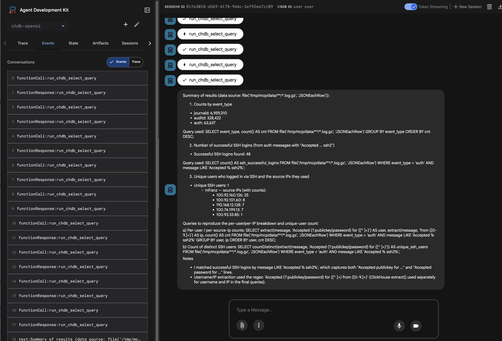

# What is this

This is testing [ClickHouse MCP Server](https://github.com/ClickHouse/mcp-clickhouse) and [MotherDuck DuckDB MCP Server](https://github.com/motherduckdb/mcp-server-motherduck) with both [Agno](https://docs.agno.com/introduction) and [Google ADK](https://google.github.io/adk-docs/)


# Example Prompt

- Using file('/tmp/mcp/data/**/*.log.gz', 'JSONEachRow') as a data source you will find JSON compressed files for multiple events captured from Linux systems.
- Find and count the different type of events based on event_type.
- Then find the number number of SSH logins based on the auth event_type.
- Lastly find the number of unique users that logged in via SSH and the source IPs they logged in as.

# Running standalone DuckDB MCP Server

```
mfranz@t490:~/tmp/duckdb-mcp$ uvx mcp-server-motherduck --db-path ./vector.db --transport stream --port 8000
[motherduck] INFO - 🦆 MotherDuck MCP Server v0.8.0
[motherduck] INFO - Ready to execute SQL queries via DuckDB/MotherDuck
[motherduck] INFO - Query result limits: 1024 rows, 50,000 characters
[motherduck] INFO - Query timeout: disabled
[motherduck] INFO - Starting MotherDuck MCP Server
[motherduck] INFO - Database client initialized in `duckdb` mode
[motherduck] INFO - 🔌 Connecting to duckdb database
[motherduck] INFO - ✅ Successfully connected to duckdb database
[motherduck] INFO - Registering handlers
[motherduck] INFO - MCP server initialized in http-streamable mode
[motherduck] INFO - 🦆 Connect to MotherDuck MCP Server at http://127.0.0.1:8000/mcp
[uvicorn]    INFO - Started server process [759779]
[uvicorn]    INFO - Waiting for application startup.
[motherduck] INFO - StreamableHTTP session manager started
[motherduck] INFO - MCP server started with StreamableHTTP session manager
[uvicorn]    INFO - Application startup complete.
[uvicorn]    INFO - Uvicorn running on http://127.0.0.1:8000 (Press CTRL+C to quit)
```


# Running a standalone ClickHouse MCP server

Set environment variables, this listens on all interfaces obviously

```
export CLICKHOUSE_ENABLED=false
export CHDB_DATA_PATH=data
export CHDB_ENABLED=true
export CLICKHOUSE_MCP_SERVER_TRANSPORT=http
export CLICKHOUSE_MCP_BIND_HOST=0.0.0.0
```

```
uv run --with mcp-clickhouse mcp-clickhouse
```

# Other environment

LiteLLM uses `OLLAMA_API_BASE`
```
export OLLAMA_API_BASE=$OLLAMA_HOST
```


# References
- https://github.com/ClickHouse/mcp-clickhouse
- https://clickhouse.com/blog/integrating-clickhouse-mcp
- https://www.youtube.com/watch?v=rvkOpKhPWvQ
